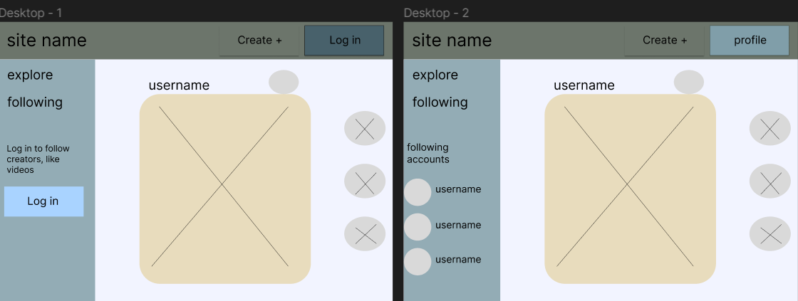

# Capture

Capture is a social media web app built using the MERN stack. It provides a platform for users to share their photography, connect with others, and engage in a vibrant community. The app allows users to post their own photos, discover and appreciate the work of fellow photographers, comment on posts, and share captivating images with their network.
-
While the app primarily caters to photographers, it is open for use by anyone who has an interest in photography or wants to explore a creative and visual community. Whether you're a professional photographer, an amateur enthusiast, or simply someone who appreciates the beauty of visual storytelling, Capture welcomes you to join and showcase your passion for photography.

## Features

Capture offers a range of features to enhance the user experience:

- **Post Creation**: Users can create posts by uploading their photographs, providing a title.
- **Interaction**: Users can engage with posts by liking, commenting, and sharing them with their followers.
- **Discover**: Users can explore a feed of posts from photographers they follow and discover new talent through curated recommendations.
- **Profile Customization**: Users have the ability to personalize their profile, upload a profile picture, and add a bio to showcase their style and interests.
- **Search Functionality (still uner devlopment)**: Users can search for specific photographers, posts, or hashtags to find content of interest.
- **Notifications (still uner devlopment)**: Users receive notifications for activities related to their posts, such as likes and comments.
- **Authentication and Security**: The app incorporates secure user authentication and authorization mechanisms to protect user data and ensure privacy.

Capture aims to provide a seamless and engaging experience for photographers and photography enthusiasts alike, fostering a community that encourages creativity, collaboration, and inspiration.

## Technologies Used

- Axios
- Bcrypt
- Body-parser
- Cloudinary
- Dotenv
- EJS
- Express
- Express-ejs-layouts
- Express-session
- fs-extra
- JSONWebToken
- JWT-decode
- Mongoose
- Mongoose-likes
- Multer
- Passport
- Passport-local

## Wireframe
---

---

## Installation

To run the application locally, follow these steps:

1. Clone the repository.
2. Open the terminal in the project's root directory and run `npm install` to install the dependencies.
3. Navigate to the `frontend` folder and run `npm install` to install frontend dependencies.

## Configuration

Certain configurations and API keys are required for the app to function properly. These configurations can be found in the project's `.env` file.

## Known Issues

- User access to other accounts is currently not available.
- The comments section is still under development.

## Demo

A live demo of the application can be accessed at [Demo URL](add_demo_url_here).

## Contribution

We welcome contributions to our project. If you're interested in contributing, please follow the guidelines below:

1. Fork the repository and clone it locally.
2. Create a new branch for your contribution: `git checkout -b feature/your-username`.
3. Make your desired changes and additions to the codebase.
4. Test your changes thoroughly to ensure they do not introduce any new issues.
5. Commit your changes with descriptive commit messages: `git commit -m "Added feature/ your username"`.
6. Push your changes to your forked repository: `git push origin Added feature/ your username`.
7. Open a pull request in our repository, explaining the purpose and details of your contribution.
8. Our team will review your pull request, provide feedback, and work with you to refine the changes if necessary.
9. Once your contribution is accepted, it will be merged into the main project branch, and you will be credited for your contribution.

Please ensure that your contributions align with our project's coding conventions, style guidelines, and follow the best practices for software development. Be respectful of others and maintain a constructive approach when engaging with the community.

We appreciate your interest and effort in contributing to our project, and we look forward to collaborating with you!

Note: By contributing to our project, you agree that your contributions will be licensed under the same license as the project.

## Bug Reports and Feedback

If you encounter any bugs or have feedback, please report them by creating an issue on our [GitHub Issues](https://git.generalassemb.ly/mohd96/Project-03/issues) page.

## Acknowledgments

We would like to acknowledge the following libraries and resources that were instrumental in building Capture:

- [Cloudinary](https://cloudinary.com/documentation/)
- [react](https://react.dev/learn)

